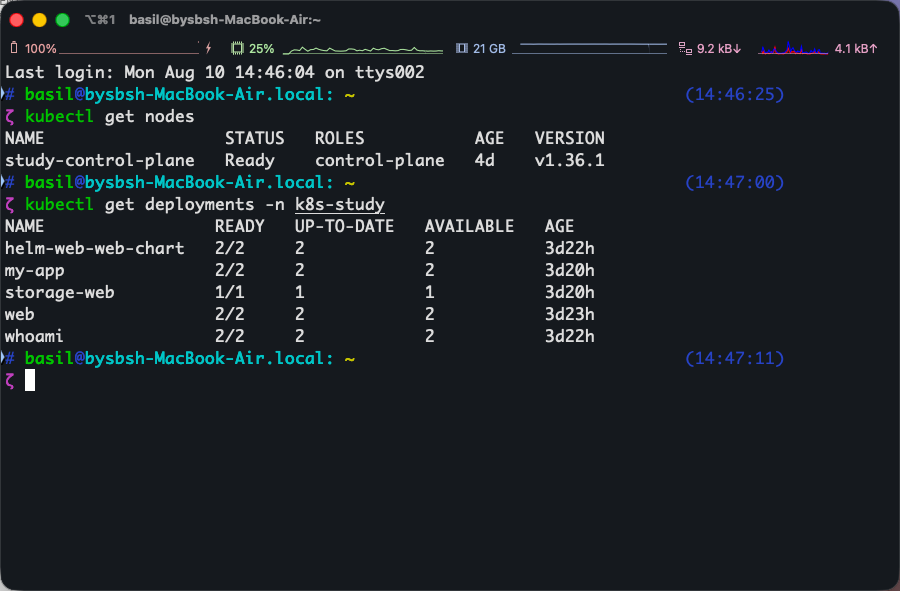

# 第 2 篇：Deployment、Pod 与 Service

## 本篇概述

- **为什么要学**：Pod 会失败、重建、改名和更换 IP，不能被当成稳定服务器直接使用。Deployment 负责维持应用实例，Service 负责提供稳定入口，它们是绝大多数 Web 服务的基础。
- **会完成什么**：部署 Nginx、扩容到多个 Pod、创建 Service，并从 Mac 和集群内部访问。
- **开始前需要**：Kind 节点为 `Ready`，kubectl 当前连接 `kind-study`。
- **完成标志**：能解释 Pod 随机名称、Service 虚拟 IP 和多 Pod 流量分发。

## 0. 开始前检查

先确认节点可用：

```bash
kubectl get nodes
```

必须看到：

```text
study-control-plane   Ready
```

创建学习命名空间。已经存在时看到 `AlreadyExists` 可以忽略：

```bash
kubectl create namespace k8s-study
```

让后续命令默认操作这个命名空间：

```bash
kubectl config set-context --current --namespace=k8s-study
```

确认：

```bash
kubectl config view --minify -o jsonpath='{..namespace}{"\n"}'
```

预期输出：

```text
k8s-study
```

## 1. 创建第一个 Deployment

```bash
kubectl create deployment web --image=nginx:1.29.8-alpine
```

作用：创建名为 `web` 的 Deployment，并让它运行 Nginx 镜像。

查看状态：

```bash
kubectl get deployments,pods
```

Pod 可能经历：

```text
ContainerCreating → Running
```

成功标准：

```text
deployment.apps/web   1/1
pod/web-...            1/1   Running
```

## 2. 为什么 Pod 名不是 nginx

Pod 名称类似：

```text
web-7fbc579fd4-t8fbv
```

组成：

```text
web           Deployment 名
7fbc579fd4    ReplicaSet 模板哈希
t8fbv         Pod 随机后缀
```

`nginx` 是镜像或容器名，`web` 是 Deployment 名。关系如下：

```text
Deployment: web
  ↓ 管理
ReplicaSet
  ↓ 创建和维持
Pod
```

Pod 是可替换实例，重建后名称和 IP 可能变化，因此通常不手工固定 Pod 名。

## 3. 扩容到三个 Pod

```bash
kubectl scale deployment web --replicas=3
kubectl get pods
```

成功时会出现三个名称不同、但都由 `web` 管理的 Pod。

Deployment 负责：

- 保持指定副本数。
- Pod 异常退出后自动补充。
- 修改镜像时滚动更新。
- 保存发布历史并支持回滚。

## 4. 创建 Service

```bash
kubectl expose deployment web \
  --name=web-service \
  --port=80 \
  --target-port=80
```

作用：创建 `ClusterIP` Service，把请求转发到标签匹配的 `web` Pod。

检查：

```bash
kubectl get services
```

示例：

```text
web-service   ClusterIP   10.96.23.220   <none>   80/TCP
```

这个 IP 是 Kubernetes 从 Service 网段自动分配的虚拟 IP，不是 Mac IP，也不是 Pod IP。

## 5. Service 如何找到 Pod

Service 使用标签选择器，而不是固定 Pod 名或 Pod IP：

```text
Service selector: app=web
          ↓
Pod labels: app=web
```

多个 Pod 存在时，Service 会把不同连接分发给可用端点：

```text
请求 → web-service
       ├── Pod IP 1
       ├── Pod IP 2
       └── Pod IP 3
```

应用不应依赖某个固定 Pod IP。

## 6. 从 Mac 临时访问 Service

```bash
kubectl port-forward service/web-service 8080:80
```

含义：

```text
Mac localhost:8080 → Service 80 → Pod 80
```

浏览器访问：

```text
http://localhost:8080
```

按 `Ctrl+C` 只停止端口转发，不会停止 Service、Deployment 或 Pod。

## 7. 从集群内部访问 Service

```bash
kubectl run test-client \
  --rm -it \
  --restart=Never \
  --image=curlimages/curl:8.12.1 \
  --command -- curl -I http://web-service
```

这会创建临时 Pod，从集群内部使用 Service DNS 名发起请求，完成后自动删除。

成功标准：

```text
HTTP/1.1 200 OK
```

## 8. 常用排查命令

```bash
kubectl describe deployment web
kubectl describe pod POD_NAME
kubectl logs POD_NAME
kubectl get events --sort-by=.lastTimestamp
kubectl rollout history deployment/web
kubectl rollout undo deployment/web
```

`rollout history` 中的 `REVISION` 是 Deployment 发布版本。如果 `CHANGE-CAUSE` 显示 `<none>`，只表示这次发布没有记录说明文字，不代表发布失败。镜像、Pod 模板或配置变化仍然会产生新 Revision。

## 9. 本篇完成标准

完成后，可以用下面两条命令同时核对节点和 Deployment 状态：

```bash
kubectl get nodes
kubectl get deployments -n k8s-study
```



> 图中还包含后续篇章创建的 Deployment，你在本篇刚完成时看到的名称和数量可能更少。判断成功的关键是 `READY`、`UP-TO-DATE` 和 `AVAILABLE` 数量一致。

- 能解释 Deployment、ReplicaSet 和 Pod 的关系。
- 知道 Pod 名和 IP 都可能变化。
- 能用 Service 为多个 Pod 提供固定入口。
- 知道退出 port-forward 不等于停止应用。

如果四项都能解释清楚，再进入下一篇；不需要背命令，知道如何查看即可。

[上一篇：学习地图与环境准备](./01-学习地图与环境准备.md) | [下一篇：YAML、配置与资源治理](./03-YAML配置与资源治理.md)
