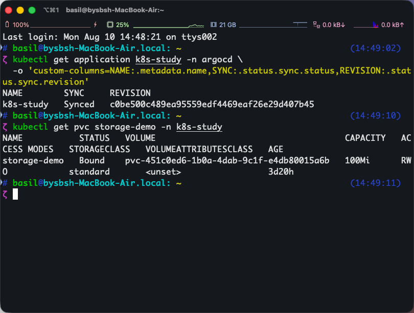

# 第 6 篇：PVC、PV 与持久化存储

## 本篇概述

- **为什么要学**：Pod 和容器都是可替换的，写在容器文件系统中的数据可能随重建消失。数据库、上传文件和业务数据必须与 Pod 生命周期分离，因此需要理解 PVC、PV 和 StorageClass。
- **会完成什么**：创建 PVC，让 Deployment 的 Pod 挂载存储，并理解 PVC、PV、StorageClass 和容器目录的关系。
- **开始前需要**：Argo CD 已管理 `k8s-study` 仓库，集群存在默认 `standard` StorageClass。
- **完成标志**：`storage-demo` 显示 `Bound`，并能指出具体哪个 Pod 引用了它。

## 0. 开始前检查

```bash
kubectl get storageclass
kubectl get namespace k8s-study
```

必须能看到默认 `standard` StorageClass 和 `k8s-study` 命名空间。

## 1. 为什么需要持久化存储

容器自身的文件系统跟随容器生命周期。Pod 被替换后，写在容器内部的数据通常会消失。

```text
Pod 重建
  ↓
容器文件系统消失
  ↓
使用 PVC/PV 保存数据
  ↓
新 Pod 重新挂载同一存储
```

## 2. 查看 StorageClass

```bash
kubectl get storageclass
```

本次 Kind 集群：

```text
standard (default)   rancher.io/local-path   Delete   WaitForFirstConsumer
```

- `standard (default)`：PVC 默认使用的存储类型。
- `rancher.io/local-path`：数据保存在 Kind 节点中。
- `Delete`：删除 PVC 后，对应存储也会被回收。
- `WaitForFirstConsumer`：等 Pod 使用 PVC 后再创建 PV。

Kind 的存储能承受 Pod 删除重建，但删除整个 Kind 集群后数据仍会消失。

## 3. 创建 PVC

创建文件：

```bash
cd ~/k8s-study
nano pvc.yaml
```

粘贴下面内容：

```yaml
apiVersion: v1
kind: PersistentVolumeClaim
metadata:
  name: storage-demo
  namespace: k8s-study
spec:
  storageClassName: standard
  accessModes:
    - ReadWriteOnce
  resources:
    requests:
      storage: 100Mi
```

- PVC 是对存储的申请。
- `100Mi` 是申请容量。
- `ReadWriteOnce` 简写为 `RWO`，表示可由一个节点以读写方式挂载。
- `storageClassName` 指定如何供应实际存储。

提交给 Git 后由 Argo CD 创建：

```bash
git add pvc.yaml
git commit -m "Add storage demo PVC"
git push
```

## 4. 为什么 PVC 一开始是 Pending

```bash
kubectl get pvc storage-demo -n k8s-study
```

可能看到：

```text
storage-demo   Pending
```

这是因为 `WaitForFirstConsumer` 正在等待一个真正引用它的 Pod。

## 5. Deployment 中引用 PVC

创建文件：

```bash
cd ~/k8s-study
nano storage-web.yaml
```

粘贴下面完整 Deployment：

```yaml
apiVersion: apps/v1
kind: Deployment
metadata:
  name: storage-web
  namespace: k8s-study
spec:
  replicas: 1
  selector:
    matchLabels:
      app: storage-web
  template:
    metadata:
      labels:
        app: storage-web
    spec:
      containers:
        - name: nginx
          image: nginx:1.29.8-alpine
          volumeMounts:
            - name: web-data
              mountPath: /usr/share/nginx/html
      volumes:
        - name: web-data
          persistentVolumeClaim:
            claimName: storage-demo
```

Pod 不是单独写在文件中，而是由 Deployment 的 `spec.template` 生成。生成出的 Pod 会包含 PVC 引用。

保存后提交：

```bash
cd ~/k8s-study
git add storage-web.yaml
git commit -m "Add deployment using persistent storage"
git push
```

让 Argo CD 立即读取最新提交：

```bash
kubectl annotate application k8s-study \
  -n argocd \
  argocd.argoproj.io/refresh=hard \
  --overwrite
```

观察 Pod：

```bash
kubectl get pods -n k8s-study -l app=storage-web --watch
```

看到 `1/1 Running` 后按 `Ctrl+C`。

检查 PVC：

```bash
kubectl get pvc storage-demo -n k8s-study
```

成功标准：`storage-demo` 从 `Pending` 变成 `Bound`。

## 6. 完整绑定关系

```text
容器目录 /usr/share/nginx/html
          ↑ volumeMounts.name: web-data
Pod Volume: web-data
          ↓ claimName: storage-demo
PVC: k8s-study/storage-demo
          ↓ StorageClass 自动创建并绑定
PV: pvc-451c0ed6-...
```

规则：

- `volumeMounts.name` 必须等于 `volumes.name`。
- `claimName` 必须等于 PVC 的 `metadata.name`。
- Pod 和 PVC 必须在同一个命名空间。
- PVC 文件名没有绑定作用。
- `mountPath` 写在 Pod/Deployment 中，不写在 PVC 中。

## 7. Namespace 不会自动共享存储

只有明确引用 `storage-demo` 的 Pod 可以访问它：

```text
k8s-study
├── Pod A → 引用 storage-demo → 可以访问
├── Pod B → 没有引用         → 无法访问
└── Pod C → 引用另一个 PVC    → 使用另一块存储
```

同一命名空间可以有多个 PVC，每个 Pod 使用哪个必须在 YAML 中明确配置。

## 8. 检查 PVC 和 PV

```bash
kubectl get pvc storage-demo -n k8s-study
kubectl get pv
```

成功状态：

```text
storage-demo   Bound   pvc-...   100Mi   RWO
```

`Bound` 表示 PVC 已绑定到实际 PV。



> 截图上半部是第 5 篇的 Argo CD 同步结果；本节重点看下半部 `storage-demo` 的 `STATUS=Bound`。

查看具体是哪个 Pod 引用：

```bash
kubectl get pods -n k8s-study -l app=storage-web
```

查看 Pod 中声明的 PVC 名：

```bash
kubectl get pod -n k8s-study \
  -l app=storage-web \
  -o jsonpath='{.items[0].spec.volumes[0].persistentVolumeClaim.claimName}{"\n"}'
```

预期输出：

```text
storage-demo
```

## 9. 持久化实验原理

写入数据：

```bash
kubectl exec -n k8s-study deployment/storage-web -- \
  sh -c 'echo "Data survives Pod recreation" > /usr/share/nginx/html/index.html'
```

删除 Pod：

```bash
kubectl delete pod -n k8s-study -l app=storage-web
```

Deployment 会创建新 Pod。新 Pod 挂载同一个 PVC 后仍能读取文件：

```bash
kubectl exec -n k8s-study deployment/storage-web -- \
  cat /usr/share/nginx/html/index.html
```

这里由 Deployment 负责重建 Pod，由 PVC/PV 负责保留数据。

## 10. 本篇完成标准

- 能区分 PVC 和 PV。
- 能解释 PVC `Pending` 与 `Bound`。
- 知道挂载路径属于 Pod/容器配置。
- 知道 Namespace 不会让所有 Pod 自动共享存储。

[上一篇：Argo CD 与 GitOps](./05-ArgoCD与GitOps.md) | [下一篇：自建镜像与滚动发布](./07-自建镜像与滚动发布.md)
