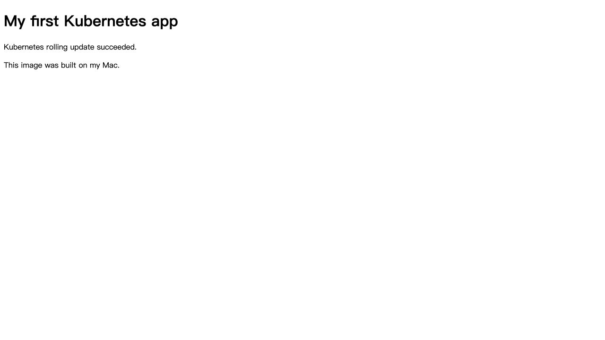

# 第 7 篇：自建镜像与滚动发布

## 本篇概述

- **为什么要学**：学习 Kubernetes 的最终目的不是运行示例镜像，而是发布自己的程序。只有走通“代码变成镜像、镜像变成 Pod、新版本安全替换旧版本”，才真正掌握应用交付流程。
- **会完成什么**：编写网页和 Dockerfile，构建 `study-web:v1/v2`，加载到 Kind，并通过 Argo CD 滚动发布。
- **开始前需要**：Docker、Traefik 和 Argo CD 正常运行，Git 仓库可以 push。
- **完成标志**：`my-app` 的两个 Pod 都运行 `study-web:v2`，浏览器能看到更新后的页面。

## 0. 开始前检查

```bash
docker version
kind get clusters
kubectl get pods -n traefik
kubectl get pods -n argocd
```

继续前应满足：Docker 同时显示 Client/Server、Kind 中存在 `study`、Traefik 和 Argo CD Pod 为 `Running`。

## 1. 部署链路

这一篇把前面的知识串成完整发布流程：

```text
index.html
  ↓ Dockerfile
study-web:v1
  ↓ kind load
Kind 节点
  ↓ Deployment
Pod
  ↓ Service
Ingress / Traefik
  ↓
http://my-app.localhost:8090
```

## 2. 准备静态网页

先创建并进入目录：

```bash
mkdir -p ~/k8s-study/app
cd ~/k8s-study/app
```

创建网页：

```bash
nano index.html
```

粘贴下面内容并按 `Ctrl+O`、Enter、`Ctrl+X` 保存：

目录：

```text
~/k8s-study/app/
├── Dockerfile
└── index.html
```

`index.html`：

```html
<!doctype html>
<html>
<head>
  <meta charset="utf-8">
  <title>My Kubernetes App</title>
</head>
<body>
  <h1>My first Kubernetes app</h1>
  <p>This image was built on my Mac.</p>
</body>
</html>
```

`Dockerfile`：

创建文件：

```bash
nano Dockerfile
```

粘贴下面内容并保存：

```dockerfile
FROM nginx:1.29.8-alpine
COPY index.html /usr/share/nginx/html/index.html
```

- `FROM`：使用 Nginx Alpine 基础镜像。
- `COPY`：把自己的网页放入 Nginx 默认站点目录。

## 3. 构建 v1 镜像

```bash
cd ~/k8s-study/app
docker build -t study-web:v1 .
```

- `docker build`：根据 Dockerfile 构建镜像。
- `-t study-web:v1`：镜像名为 `study-web`，标签为 `v1`。
- 最后的 `.`：构建上下文为当前目录。

检查：

```bash
docker images study-web
docker image inspect study-web:v1
```

Docker 镜像不是普通目录，而是由 Docker Desktop 分层管理。需要导出成普通文件时可以执行：

```bash
docker save study-web:v1 -o ~/k8s-study/study-web-v1.tar
```

正常部署不需要导出 tar。

## 4. 加载镜像到 Kind

Mac Docker 和 Kind 节点的容器运行时彼此独立。构建完成后还要复制到 Kind：

```bash
kind load docker-image study-web:v1 --name study
```

验证：

```bash
docker exec study-control-plane crictl images | grep study-web
```

预期：

```text
docker.io/library/study-web   v1
```

这一步没有把镜像上传到互联网。云集群需要从 Docker Hub、GHCR 或私有镜像仓库拉取。

## 5. 创建 Deployment、Service 和 Ingress

创建文件：

```bash
cd ~/k8s-study
nano my-app.yaml
```

粘贴下面完整内容：

```yaml
apiVersion: apps/v1
kind: Deployment
metadata:
  name: my-app
  namespace: k8s-study
spec:
  replicas: 2
  selector:
    matchLabels:
      app: my-app
  template:
    metadata:
      labels:
        app: my-app
    spec:
      containers:
        - name: web
          image: study-web:v1
          imagePullPolicy: Never
          ports:
            - containerPort: 80
---
apiVersion: v1
kind: Service
metadata:
  name: my-app
  namespace: k8s-study
spec:
  selector:
    app: my-app
  ports:
    - port: 80
      targetPort: 80
---
apiVersion: networking.k8s.io/v1
kind: Ingress
metadata:
  name: my-app
  namespace: k8s-study
spec:
  ingressClassName: traefik
  rules:
    - host: my-app.localhost
      http:
        paths:
          - path: /
            pathType: Prefix
            backend:
              service:
                name: my-app
                port:
                  number: 80
```

`imagePullPolicy: Never` 表示只使用 Kind 节点中的本地镜像。如果忘记执行 `kind load`，Pod 会启动失败。

## 6. 通过 Git 和 Argo CD 发布 v1

```bash
cd ~/k8s-study
git add app my-app.yaml
git commit -m "Deploy custom static web image"
git push
```

不要执行 `kubectl apply`。等待 Argo CD，或主动刷新：

```bash
kubectl annotate application k8s-study \
  -n argocd \
  argocd.argoproj.io/refresh=hard \
  --overwrite
```

观察：

```bash
kubectl get pods -n k8s-study -l app=my-app --watch
```

成功标准：两个 Pod 都为 `1/1 Running`。

访问：

```text
http://my-app.localhost:8090
```

前提：Traefik 的 port-forward 仍在运行。

## 7. 构建 v2

修改 `app/index.html` 后：

```bash
docker build -t study-web:v2 ~/k8s-study/app
kind load docker-image study-web:v2 --name study
```

检查：

```bash
docker exec study-control-plane crictl images | grep study-web
```

应同时看到 `v1` 和 `v2`。

每个版本使用不同标签，不反复覆盖 `v1`。这样能明确集群运行的版本，也方便回滚。

## 8. 更新 Deployment 目标版本

将 `my-app.yaml` 中：

```yaml
image: study-web:v1
```

改成：

```yaml
image: study-web:v2
```

提交：

```bash
git add app/index.html my-app.yaml
git commit -m "Release static web v2"
git push
```

## 9. 观察滚动更新

```bash
kubectl get pods -n k8s-study -l app=my-app --watch
```

典型过程：

```text
旧 Pod 继续 Running
新 Pod ContainerCreating
新 Pod Running
旧 Pod Terminating
```

Deployment 会逐步替换实例，尽量保证网站持续可用。

确认镜像版本：

```bash
kubectl get pods -n k8s-study -l app=my-app \
  -o 'custom-columns=NAME:.metadata.name,IMAGE:.spec.containers[0].image'
```

两个 Pod 都应显示：

```text
study-web:v2
```

刷新 `http://my-app.localhost:8090`，确认页面已经来自 v2 镜像：



## 10. 本地方案与生产方案的区别

本次学习：

```text
docker build → kind load → imagePullPolicy: Never
```

生产环境：

```text
CI 构建 → 推送镜像仓库 → Kubernetes 拉取镜像
```

生产配置通常使用完整镜像名，例如：

```yaml
image: ghcr.io/example/study-web:v2
imagePullPolicy: IfNotPresent
```

## 11. 本篇完成标准

- 能编写简单 Dockerfile。
- 能解释 Mac Docker 与 Kind 节点镜像库的区别。
- 能通过 Git 和 Argo CD 发布自己的镜像。
- 能观察并验证 Deployment 滚动更新。

[上一篇：PVC、PV 与持久化存储](./06-PVC-PV与持久化存储.md) | [下一篇：常见故障排查手册](./08-常见故障排查手册.md)
